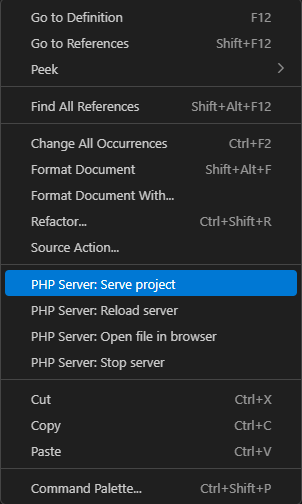

# My project - Frugal Company website

## INSTALLATION

- VSCODE
- EXTENSIONS (PHP Intelephense)
- SQL Server (myssql)
- SQL Database Projects
- GIT
- DOCKER
- ESLINT
- PHP SERVER
- AMPPS (Apache, MySQL, PHP skip the S)
- Install node_modules.

## USAGE

RUN PHP SERVER EXTENSION:

## DEPLOYMENT

- [Database](./frugal_company.sql)

- [Simulate DB server through docker before deployment](https://www.docker.com/products/docker-desktop/)

- [Deploy SQL DB](api.clever-cloud.com)

- [Render](https://newproject-qyzl.onrender.com/index.php)

- Add SQL Deployment's env keys into Render env variables.

- Add [dockerfile](./dockerfile), [render.yaml](./render.yaml) & [.gitlab-ci.yml](/.gitlab-ci.yml)

## TESTING

- [Jest test for JS tests](./main.test.js) - Commands in terminal: npm test - [package.json](./package.json), [package-lock.json](./package-lock.json)

- ESLINT RUN - Commands in terminal: npx eslint . --ext .js

- [PHPunit for PHP tests](./tests/cartTest.php) - Commands in terminal: php vendor/bin/phpunit / php vendor/bin/phpunit --testdox - [composer.json](./composer.json), [composer.lock](./composer.lock)

## LICENSE

[MIT](../newproject//LICENSE)